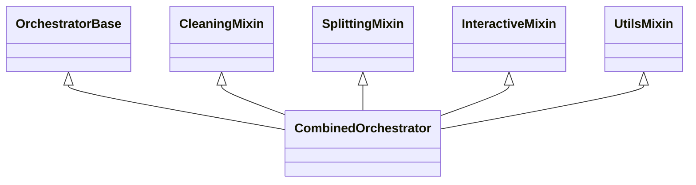

# README.md - aggregator Nickname


A Python tool for aggregating, normalizing, and deduplicating over 220 million usernames, first names, and last names from more than 30 repositories and datasets.

## Modular Architecture of the Orchestrator

The orchestrator is based on a modular architecture using mixins to ensure maintainability, reusability, and performance. All critical functionalities are centralized in specialized modules:

- **OrchestratorBase**: configuration management, paths, stats, and error handling.
- **CleaningMixin**: cleaning operations (standard and strict).
- **SplittingMixin**: splitting of raw and deduplicated files.
- **InteractiveMixin**: interactive menu, real-time statistics, UX security.
- **UtilsMixin**: utilities shared between modules.
- **CombinedOrchestrator**: central class that aggregates all mixins to expose all functionalities.



**Main entry point**:
- `python run_menu.py` - Simplified multilingual interface (recommended)

**Alternative entry points**:
- `python -m aggregator.orchestrator` or `python -m aggregator.orchestrate` - Original version
- Advanced CLI via Typer (`aggregator/cli.py`) - For advanced users

## Features

- Asynchronous download of more than 30 repositories and datasets
- Data normalization (lowercase, accent removal, strict special character removal: only `[a-z0-9_.- ]` characters are kept, empty string removal)
- High-performance deduplication with priority order preservation
- Streaming export in blocks of 1 million lines
- Support for large data volumes (>220M entries)
- Complete command-line interface
- **Interactive orchestrator** with real-time statistics
- **Automatic installation** of dependencies and project configuration
- **Intelligent raw data cleaning**: file organization by category with automatic file name correction and original backup
- **Downloaded file validation**: verification of file existence and accessibility before normalization
- **Automatic binary file detection**: specific processing adapted to file type (text or binary)
- Archive management (zip, tar.gz, tgz): automatic extraction before normalization
- Support for `japanese_names` slug: separate reading of male and female files, username normalization, and Parquet export
- Support for `hypixel` slug: merging of `epicube-players` and `hypixel-players` files, username normalization, and Parquet export
- Support for `runescape_2014` slug: download via HTTP from configured URL, archive extraction, reading of all .txt files, and Parquet export
- Creation of chunks from normalized data (5 million lines per chunk) to facilitate management of very large volumes
- Sequential deduplication of raw chunks to produce a final file without duplicates
- **Automatic split of deduplicated data into .txt files of 500 lines during the complete pipeline (option 12), in the `output/final/` folder**

## Requirements

- Python 3.11 or higher
- [Poetry](https://python-poetry.org/docs/#installation) for dependency management
- About 8-10 GB of free disk space to process all 220M entries
- Recommended memory: 8 GB minimum, 16 GB for optimal performance

## Installation

```bash
# Clone the repository
git clone https://github.com/DiAbL0Tin/aggregator-nicknames.git
cd aggregator-nicknames

# Install dependencies with Poetry
pip install poetry
poetry install
```

## Usage

### Quick Start (recommended)

```bash
# Launch the application with the multilingual interface (French/English)
python run_menu.py
```

This main interface allows you to:
- Choose your language (French by default, English available)
- Access all orchestrator functionalities with a localized user experience
- Navigate easily between different options
- Use all application features intuitively

### Multilingual Configuration

Translations are managed in the `aggregator/orchestration/translations.py` file.

- To change language during execution: restart the `run_menu.py` script and select the desired language at startup
- To add a new language:
  1. Add translation keys in the `TRANSLATIONS` dictionary in translations.py
  2. Modify the `get_available_languages()` function in the same file

### Interactive Orchestrator (alternative method)

```bash
# Launch the interactive orchestrator directly
python -m aggregator.orchestrate --config config.yaml
```

The interactive orchestrator allows you to:
- **1.** Install dependencies and configure the project
- **2.** Download/update sources
- **3.** Normalize data
- **4.** Create chunks from normalized data (5M lines)
- **5.** Deduplicate data
- **6.** Export data
- **7.** Split the deduplicated file
    - Allows splitting the deduplicated file into several smaller files by specifying the number of lines per file.
- **8.** Split the deduplicated file in test mode
    - Feature to split only the first lines of the deduplicated file into a specified number of files, with a user-defined number of lines per file.
    - Ideal for testing phases, as it processes a limited sample of data rather than the complete file.
- **9.** Empty the final folder (deduplicated splits)
- **10.** Empty the raw folder (remove sources)
- **11.** Empty the normalized data cache
- **12.** Empty temporary files
- **13.** Strict cleaning: remove everything except essential files/folders (see below)
    - ⚠️ Mandatory confirmation, enhanced security, whitelist: `README.md`, `config.yaml`, `pyproject.toml`, `poetry.lock`, `aggregator/`, `tests/`, `.github/`.
    - The old reset (total deletion) is no longer accessible from the menu, but remains in the code for technical fallback.
- **14.** Run the program in complete automatic mode
    - Sequentially executes: strict cleaning (13), download (1), normalization (2), chunk creation (4), deduplication (5), export (6), and split of the deduplicated file (7) with 1,000,000 lines per file.
- **15.** Run the program in automatic mode with choice of lines per file
    - Similar to option 14, but allows specifying the number of lines per file for the final division.
    - Useful for adapting output file size to your specific needs.
- **16.** Display real-time statistics
- **0.** Quit

### Complete Pipeline (CLI)

```bash
# Run the complete pipeline
poetry run python -m aggregator.cli run --config config.yaml

# With options
poetry run python -m aggregator.cli run --config config.yaml --force --keep-original --output custom_output.txt
```

### Individual Commands (CLI)

```bash
# Download only
poetry run python -m aggregator.cli download --config config.yaml

# Normalization (includes download)
poetry run python -m aggregator.cli normalize --config config.yaml

# Deduplication (includes download and normalization)
poetry run python -m aggregator.cli dedupe --config config.yaml

# Export (runs the complete pipeline)
poetry run python -m aggregator.cli export --config config.yaml --output custom_output.txt
```

### Options

- `--config`, `-c`: Path to the configuration file (default: `config.yaml`)
- `--force`, `-f`: Force download and processing even if the cache exists
- `--keep-original`, `-k`: Keep original forms
- `--output`, `-o`: Output file name (default: `aggregator_nicks.txt`)
- `--high-volume`: Use high-performance approach for large volumes (default: `True`)

## Project Structure

```
aggregator_nickname/
 ├─ aggregator/
 │   ├─ __init__.py      # Package initialization
 │   ├─ cli.py           # Command-line interface (Typer)
 │   ├─ config.py        # Configuration models (Pydantic)
 │   ├─ download.py      # Asynchronous download
 │   ├─ normalize.py     # Data normalization
 │   ├─ dedupe.py        # Deduplication
 │   ├─ export.py        # Streaming export
 │   ├─ orchestrator.py  # Interactive orchestrator with statistics
 │   └─ orchestrate.py   # Entry point for the orchestrator
 │   └─ orchestration/   # Modular components
 ├─ data/               # Data folder (created automatically)
 ├─ tests/               # Unit tests
 ├─ pyproject.toml       # Poetry configuration
 ├─ README.md            # Documentation
 └─ .github/workflows/   # GitHub Actions CI
```

## Configuration

The `config.yaml` file contains the list of sources to download, with their type, priority, and access information. The order of sources in the file determines their priority during deduplication.

Configuration example:

```yaml
sources:
  - slug: paranames
    type: wikidata
    access: zenodo
    ref: turn0search8
  - slug: runescape_2014
    type: git
    repo: RuneStar/name-cleanup-2014
    ref: turn0search2
  # ...
defaults:
  cache_dir: data/raw
  force: false
  workers: 32
```

## Automatic Installation

The interactive orchestrator offers an automatic installation option that:
- Checks and installs Poetry if necessary
- Installs project dependencies
- Creates the required directory structure
- Checks and configures git
- Prepares the environment for first use

## Security and Validation

- **Data validation**:
    - All input files are validated before processing
    - Automatic detection of encoding issues
    - Clear error messages and detailed reporting
- **Error handling**:
    - Robust error handling at each stage of the pipeline
    - Recovery mechanisms for interrupted processes
    - Educational error messages that don't leak sensitive information
    - User inputs are systematically validated in the interactive menu
- **Logs**:
    - Use of the `rich` console for all logs
    - Possibility to add an advanced logging module (level, format, destination) for production

## Technical Pipeline

### Automatic Pipeline Options

#### Option 14: Standard Automatic Mode

This option sequentially executes all necessary steps with a fixed output file size of 1,000,000 lines per file.

#### Option 15: Automatic Mode with Choice of Lines

Similar to option 14, but allows specifying the number of lines per file for the final division. Useful for adapting output file size to specific needs.

### Execution Sequence

The pipeline automatically chains the following steps:
- **1.** Strict cleaning
- **2.** Source download
- **3.** Normalization
- **4.** Creation of chunks from normalized data
- **5.** Deduplication
- **6.** Split of deduplicated data

All with real-time statistics and educational guidance.

- **Intelligent raw data cleaning (`clean_raw_data.py`)**:
    - Automatic organization of files by category (names, first names, usernames, etc.)
    - Normalization of file names with correction of special characters, spaces, and inconsistent formatting
    - Secure backup of original files in a `_original_data_backup` subfolder
    - Robust processing with error handling at each step
    - Duplicate detection and automatic renaming in case of conflict
    - Execution: `python aggregator/scripts/clean_raw_data.py`

- **Advanced cache verification during download**:
    - The pipeline only considers the cache valid if the cache folder contains at least one recognized data file (`.txt`, `.csv`, `.parquet`, `.json`, `.tsv`).
    - If no such file is found, the download is forced even if the folder exists.
    - This avoids using an incomplete or corrupted cache (for example, a simple `.git` folder is not sufficient).
    - Example log:
      ```
      Existing cache for mysource but no valid data file found, forced download.
      Using existing cache for mysource (at least one data file detected)
      ```

- **Downloaded file validation**:
    - Verification of file existence and accessibility before normalization
    - Distinction between valid and invalid files with detailed report
    - `validate_downloaded_files` function to filter problematic files
    - Secure processing by the downloader that only uses valid files

- **Automatic binary file detection**:
    - `is_binary_file` function analyzing file extension and content
    - Specific processing adapted to file type (text or binary)
    - Support for multiple formats without risk of corruption
    - Protection against encoding errors on non-textual files

1. **Asynchronous download**: Downloads sources in parallel with a maximum of 32 workers.
2. **Normalization**: Cleans data (lowercasing, accent removal, strict special character removal: only `[a-z0-9_.- ]` characters are kept, empty string and duplicate removal, educational filtering to ensure usable usernames).
3. **Deduplication**: Deduplicates data while preserving priority order.
4. **Automatic split**: Deduplicated data is automatically split into .txt files of 500 lines in `output/final/` during the complete pipeline (option 12).
5. **Export**: Exports data in blocks of 1 million lines or according to the requested format.

## Real-time Statistics

The interactive orchestrator provides real-time statistics:
- Number of sources downloaded and normalized
- Number of raw, normalized, and deduplicated entries
- Deduplication rate
- Execution time for each step
- Visual progression with progress bars

## Data Pipeline


## Technical Stack

- **HTTP async**: aiohttp
- **DataFrame**: polars
- **Typing/validation**: pydantic v2
- **Accent removal**: Unidecode
- **Lint/format**: ruff
- **Tests**: pytest
- **CLI UX**: rich + tqdm + typer

## Development

### Tests

```bash
# Run tests
poetry run pytest

# With coverage
poetry run pytest --cov=aggregator
```

### Lint

```bash
# Check code with ruff
poetry run ruff check .

# Format code
poetry run ruff format .
```

### Typing

```bash
# Check typing
poetry run pyright
```

## FAQ

### Frequently Asked Questions

**Q: How to optimize processing of large volumes?**  
A: Use the chunking option (option 4) with an optimal block size for your memory (2-5M lines) and make sure you have at least 8 GB of RAM available.

**Q: How can I add a new data source?**  
A: Add an entry in the `config.yaml` file with the slug, type, URL, and other necessary parameters.

**Q: Non-ASCII characters are lost during normalization, is this normal?**  
A: Yes, this is the expected behavior. Normalization converts all characters to ASCII compatible to maximize compatibility.

**Q: How to resolve the `MemoryError` during deduplication?**  
A: Use the chunking mode to process data in smaller blocks.

## Contributing

Contributions are welcome! 

## License

MIT

_______________________________________________________________________________

# README.md - aggregator Nickname


Un outil Python pour agréger, normaliser et dédupliquer plus de 220 millions de pseudos, prénoms et noms à partir de plus de 30 dépôts et datasets.

## Architecture modulaire de l'orchestrateur

L'orchestrateur repose sur une architecture modulaire basée sur des mixins pour garantir la maintenabilité, la réutilisabilité et la performance. Toutes les fonctionnalités critiques sont centralisées dans des modules spécialisés :

- **OrchestratorBase** : gestion de la configuration, des chemins, des stats, et des erreurs.
- **CleaningMixin** : opérations de nettoyage (classique et strict).
- **SplittingMixin** : découpage des fichiers bruts et dédupliqués.
- **InteractiveMixin** : menu interactif, statistiques temps réel, sécurité UX.
- **UtilsMixin** : utilitaires partagés entre modules.
- **CombinedOrchestrator** : classe centrale qui agrège tous les mixins pour exposer toutes les fonctionnalités.


**Point d'entrée principal** :
- `python run_menu.py` - Interface multilingue simplifiée (recommandé)

**Points d'entrée alternatifs** :
- `python -m aggregator.orchestrator` ou `python -m aggregator.orchestrate` - Version originale
- CLI avancée via Typer (`aggregator/cli.py`) - Pour utilisateurs avancés

## Fonctionnalités

- Téléchargement asynchrone de plus de 30 dépôts et datasets
- Normalisation des données (minuscules, suppression des accents, suppression stricte des caractères spéciaux : seuls les caractères `[a-z0-9_.- ]` sont conservés, suppression des chaînes vides)
- Déduplication haute performance avec préservation de l'ordre de priorité
- Export streaming par blocs d'1 million de lignes
- Support pour les grands volumes de données (>220M entrées)
- Interface en ligne de commande complète
- **Orchestrateur interactif** avec statistiques en temps réel
- **Installation automatique** des dépendances et configuration du projet
- **Nettoyage intelligent des données brutes** : organisation des fichiers par catégorie avec correction automatique des noms de fichiers et sauvegarde des originaux
- **Validation des fichiers téléchargés** : vérification de l'existence et de l'accessibilité des fichiers avant normalisation
- **Détection automatique de fichiers binaires** : traitement spécifique adapté au type de fichier (texte ou binaire)
- Gestion des archives (zip, tar.gz, tgz) : extraction automatique avant normalisation
- Support du slug `japanese_names` : lecture séparée des fichiers male et female, normalisation des pseudos et export Parquet
- Support du slug `hypixel` : fusion des fichiers `epicube-players` et `hypixel-players`, normalisation des pseudos et export Parquet
- Support du slug `runescape_2014` : téléchargement via HTTP depuis URL configurée, extraction de l'archive, lecture de tous les fichiers .txt et export Parquet
- Création de chunks depuis les données normalisées (5 millions de lignes par chunk) pour faciliter la gestion des très grands volumes
- Déduplication séquentielle des chunks bruts pour produire un fichier final sans doublon
- **Split automatique des données dédupliquées en fichiers .txt de 500 lignes lors du pipeline complet (option 12), dans le dossier `output/final/`**

## Prérequis

- Python 3.11 ou supérieur
- [Poetry](https://python-poetry.org/docs/#installation) pour la gestion des dépendances
- Environ 8-10 Go d'espace disque libre pour traiter l'ensemble des 220M d'entrées
- Mémoire recommandée : 8 Go minimum, 16 Go pour performances optimales

## Installation

```bash
# Cloner le dépôt
git clone https://github.com/DiAbL0Tin/aggregator-nicknames.git
cd aggregator-nicknames

# Installer les dépendances avec Poetry
pip install poetry
poetry install
```

## Utilisation

### Démarrage rapide (recommandé)

```bash
# Lancer l'application avec l'interface multilingue (français/anglais)
python run_menu.py
```

Cette interface principale vous permet de :
- Choisir votre langue (français par défaut, anglais disponible)
- Accéder à toutes les fonctionnalités de l'orchestrateur avec une expérience utilisateur localisée
- Naviguer facilement entre les différentes options
- Utiliser toutes les fonctionnalités de l'application de manière intuitive

### Configuration multilingue

Les traductions sont gérées dans le fichier `aggregator/orchestration/translations.py`.

- Pour changer de langue en cours d'exécution : relancez le script `run_menu.py` et sélectionnez la langue désirée au démarrage
- Pour ajouter une nouvelle langue :
  1. Ajoutez les clés de traduction dans le dictionnaire `TRANSLATIONS` du fichier translations.py
  2. Modifiez la fonction `get_available_languages()` dans le même fichier

### Orchestrateur interactif (méthode alternative)

```bash
# Lancer l'orchestrateur interactif directement
python -m aggregator.orchestrate --config config.yaml
```

L'orchestrateur interactif vous permet de :
- **1.** Installer les dépendances et configurer le projet
- **2.** Télécharger/mettre à jour les sources
- **3.** Normaliser les données
- **4.** Créer des chunks depuis les données normalisées (5 M lignes)
- **5.** Dédupliquer les données
- **6.** Exporter les données
- **7.** Diviser le fichier dédupliqué
    - Permet de diviser le fichier dédupliqué en plusieurs fichiers plus petits en spécifiant le nombre de lignes par fichier.
- **8.** Diviser le fichier dédupliqué en mode test
    - Fonctionnalité permettant de diviser uniquement les premières lignes du fichier dédupliqué en un nombre spécifié de fichiers, avec un nombre de lignes par fichier défini par l'utilisateur.
    - Idéal pour les phases de test, car traite un échantillon limité de données plutôt que le fichier complet.
- **9.** Vider le dossier final (splits dédupliqués)
- **10.** Vider le dossier raw (supprimer les sources)
- **11.** Vider le cache des données normalisées
- **12.** Vider les fichiers temporaires
- **13.** Nettoyage strict : supprimer tout sauf les fichiers/dossiers essentiels (voir ci-dessous)
    - ⚠️ Confirmation obligatoire, sécurité renforcée, whitelist : `README.md`, `config.yaml`, `pyproject.toml`, `poetry.lock`, `aggregator/`, `tests/`, `.github/`.
    - L'ancienne remise à zéro (suppression totale) n'est plus accessible par le menu, mais reste dans le code pour fallback technique.
- **14.** Lancer le programme en mode automatique complet
    - Exécute séquentiellement : nettoyage strict (13), téléchargement (1), normalisation (2), création de chunks (4), déduplication (5), export (6), et division du fichier dédupliqué (7) avec 1 000 000 lignes par fichier.
- **15.** Lancer le programme en mode automatique avec choix du nombre de lignes par fichier
    - Similaire à l'option 14, mais permet de spécifier le nombre de lignes par fichier pour la division finale.
    - Utile pour adapter la taille des fichiers de sortie à vos besoins spécifiques.
- **16.** Afficher les statistiques en temps réel
- **0.** Quitter

### Pipeline complet (CLI)

```bash
# Exécuter le pipeline complet
poetry run python -m aggregator.cli run --config config.yaml

# Avec options
poetry run python -m aggregator.cli run --config config.yaml --force --keep-original --output custom_output.txt
```

### Commandes individuelles (CLI)

```bash
# Téléchargement uniquement
poetry run python -m aggregator.cli download --config config.yaml

# Normalisation (inclut le téléchargement)
poetry run python -m aggregator.cli normalize --config config.yaml

# Déduplication (inclut le téléchargement et la normalisation)
poetry run python -m aggregator.cli dedupe --config config.yaml

# Export (exécute le pipeline complet)
poetry run python -m aggregator.cli export --config config.yaml --output custom_output.txt
```

### Options

- `--config`, `-c` : Chemin vers le fichier de configuration (défaut: `config.yaml`)
- `--force`, `-f` : Forcer le téléchargement et le traitement même si le cache existe
- `--keep-original`, `-k` : Conserver les formes originales
- `--output`, `-o` : Nom du fichier de sortie (défaut: `aggregator_nicks.txt`)
- `--high-volume` : Utiliser l'approche haute performance pour les grands volumes (défaut: `True`)

## Structure du projet

```
aggregator_nickname/
 ├─ aggregator/
 │   ├─ __init__.py      # Initialisation du package
 │   ├─ cli.py           # Interface en ligne de commande (Typer)
 │   ├─ config.py        # Modèles de configuration (Pydantic)
 │   ├─ download.py      # Téléchargement asynchrone
 │   ├─ normalize.py     # Normalisation des données
 │   ├─ dedupe.py        # Déduplication
 │   ├─ export.py        # Export streaming
 │   ├─ orchestrator.py  # Orchestrateur interactif avec statistiques
 │   └─ orchestrate.py   # Point d'entrée pour l'orchestrateur
 │   └─ orchestration/   # Composants modulaires
 ├─ data/               # Dossier de données (créé automatiquement)
 ├─ tests/               # Tests unitaires
 ├─ pyproject.toml       # Configuration Poetry
 ├─ README.md            # Documentation
 └─ .github/workflows/   # CI GitHub Actions
```

## Configuration

Le fichier `config.yaml` contient la liste des sources à télécharger, avec leur type, leur priorité et leurs informations d'accès. L'ordre des sources dans le fichier détermine leur priorité lors de la déduplication.

Exemple de configuration :

```yaml
sources:
  - slug: paranames
    type: wikidata
    access: zenodo
    ref: turn0search8
  - slug: runescape_2014
    type: git
    repo: RuneStar/name-cleanup-2014
    ref: turn0search2
  # ...
defaults:
  cache_dir: data/raw
  force: false
  workers: 32
```

## Installation automatique

L'orchestrateur interactif propose une option d'installation automatique qui :
- Vérifie et installe Poetry si nécessaire
- Installe les dépendances du projet
- Crée la structure de répertoires requise
- Vérifie et configure git
- Prépare l'environnement pour la première utilisation

## Sécurité et validation

- **Validation des données** :
    - Tous les fichiers d'entrée sont validés avant traitement
    - Détection automatique des problèmes d'encodage
    - Messages d'erreur clairs et rapports détaillés
- **Gestion des erreurs** :
    - Gestion robuste des erreurs à chaque étape du pipeline
    - Mécanismes de récupération pour les processus interrompus
    - Messages d'erreur éducatifs qui ne divulguent pas d'informations sensibles
    - Les entrées utilisateur sont systématiquement validées dans le menu interactif
- **Logs** :
    - Utilisation de la console `rich` pour tous les logs
    - Possibilité d'ajouter un module de journalisation avancé (niveau, format, destination) pour la production

## Pipeline technique

### Options de pipeline automatique

#### Option 14 : Mode automatique standard

Cette option exécute séquentiellement toutes les étapes nécessaires avec une taille fixe de fichier de sortie de 1 000 000 lignes par fichier.

#### Option 15 : Mode automatique avec choix de lignes

Similaire à l'option 14, mais permet de spécifier le nombre de lignes par fichier pour la division finale. Utile pour adapter la taille des fichiers de sortie à des besoins spécifiques.

### Séquence d'exécution

Le pipeline enchaîne automatiquement les étapes suivantes :
- **1.** Nettoyage strict
- **2.** Téléchargement des sources
- **3.** Normalisation
- **4.** Création de chunks à partir des données normalisées
- **5.** Déduplication
- **6.** Division des données dédupliquées

Le tout avec des statistiques en temps réel et des conseils éducatifs.

- **Nettoyage intelligent des données brutes (`clean_raw_data.py`)** :
    - Organisation automatique des fichiers par catégorie (noms, prénoms, pseudos, etc.)
    - Normalisation des noms de fichiers avec correction des caractères spéciaux, espaces et formatage incohérent
    - Sauvegarde sécurisée des fichiers originaux dans un sous-dossier `_original_data_backup`
    - Traitement robuste avec gestion des erreurs à chaque étape
    - Détection des doublons et renommage automatique en cas de conflit
    - Exécution : `python aggregator/scripts/clean_raw_data.py`

- **Vérification avancée du cache pendant le téléchargement** :
    - Le pipeline considère le cache valide uniquement si le dossier cache contient au moins un fichier de données reconnu (`.txt`, `.csv`, `.parquet`, `.json`, `.tsv`).
    - Si aucun fichier de ce type n'est trouvé, le téléchargement est forcé même si le dossier existe.
    - Cela évite d'utiliser un cache incomplet ou corrompu (par exemple, un simple dossier `.git` n'est pas suffisant).
    - Exemple de log :
      ```
      Cache existant pour masource mais aucun fichier de données valide trouvé, téléchargement forcé.
      Utilisation du cache existant pour masource (au moins un fichier de données détecté)
      ```

- **Validation des fichiers téléchargés** :
    - Vérification de l'existence et de l'accessibilité des fichiers avant normalisation
    - Distinction entre fichiers valides et invalides avec rapport détaillé
    - Fonction `validate_downloaded_files` pour filtrer les fichiers problématiques
    - Traitement sécurisé par le téléchargeur qui n'utilise que des fichiers valides

- **Détection automatique de fichiers binaires** :
    - Fonction `is_binary_file` analysant l'extension et le contenu du fichier
    - Traitement spécifique adapté au type de fichier (texte ou binaire)
    - Support pour plusieurs formats sans risque de corruption
    - Protection contre les erreurs d'encodage sur les fichiers non textuels

1. **Téléchargement asynchrone** : Télécharge les sources en parallèle avec un maximum de 32 workers.
2. **Normalisation** : Nettoie les données (minuscules, suppression des accents, suppression stricte des caractères spéciaux : seuls les caractères `[a-z0-9_.- ]` sont conservés, suppression des chaînes vides et des doublons, filtrage éducatif pour garantir des noms d'utilisateur utilisables).
3. **Déduplication** : Déduplique les données tout en préservant l'ordre de priorité.
4. **Split automatique** : Les données dédupliquées sont automatiquement divisées en fichiers .txt de 500 lignes dans `output/final/` pendant le pipeline complet (option 12).
5. **Export** : Exporte les données par blocs d'un million de lignes ou selon le format demandé.

## Statistiques en temps réel

L'orchestrateur interactif fournit des statistiques en temps réel :
- Nombre de sources téléchargées et normalisées: **25 sources téléchargées**
- Nombre d'entrées brutes, normalisées et dédupliquées:
  - **3 423 696** entrées brutes
  - **297 382 422** entrées normalisées
  - **74 909 733** entrées dédupliquées
- Taux de déduplication
- Temps d'exécution pour chaque étape
- Progression visuelle avec barres de progression

## Pipeline de données


## Stack technique

- **HTTP async** : aiohttp
- **DataFrame** : polars
- **Typage/validation** : pydantic v2
- **Suppression des accents** : Unidecode
- **Lint/format** : ruff
- **Tests** : pytest
- **CLI UX** : rich + tqdm + typer

## Développement

### Tests

```bash
# Exécuter les tests
poetry run pytest

# Avec couverture
poetry run pytest --cov=aggregator
```

### Lint

```bash
# Vérifier le code avec ruff
poetry run ruff check .

# Formater le code
poetry run ruff format .
```

### Typage

```bash
# Vérifier le typage
poetry run pyright
```

## FAQ

### Questions fréquemment posées

**Q : Comment optimiser le traitement des grands volumes ?**  
R : Utilisez l'option de chunking (option 4) avec une taille de bloc optimale pour votre mémoire (2-5M lignes) et assurez-vous d'avoir au moins 8 Go de RAM disponible.

**Q : Comment puis-je ajouter une nouvelle source de données ?**  
R : Ajoutez une entrée dans le fichier `config.yaml` avec le slug, le type, l'URL et les autres paramètres nécessaires.

**Q : Les caractères non-ASCII sont perdus lors de la normalisation, est-ce normal ?**  
R : Oui, c'est le comportement attendu. La normalisation convertit tous les caractères en ASCII compatible pour maximiser la compatibilité.

**Q : Comment résoudre l'erreur `MemoryError` pendant la déduplication ?**  
R : Utilisez le mode chunking pour traiter les données en blocs plus petits.

## Contribuer

Les contributions sont les bienvenues !

## Licence

MIT
