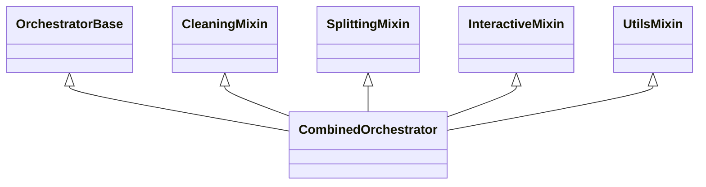

# README.md - aggregator Nickname


Un outil Python pour agréger, normaliser et dédupliquer plus de 220 millions de pseudos, prénoms et noms à partir de plus de 30 dépôts et datasets.

## Architecture modulaire de l'orchestrateur

L'orchestrateur repose sur une architecture modulaire basée sur des mixins pour garantir la maintenabilité, la réutilisabilité et la performance. Toutes les fonctionnalités critiques sont centralisées dans des modules spécialisés :

- **OrchestratorBase** : gestion de la configuration, des chemins, des stats, et des erreurs.
- **CleaningMixin** : opérations de nettoyage (classique et strict).
- **SplittingMixin** : découpage des fichiers bruts et dédupliqués.
- **InteractiveMixin** : menu interactif, statistiques temps réel, sécurité UX.
- **UtilsMixin** : utilitaires partagés entre modules.
- **CombinedOrchestrator** : classe centrale qui agrège tous les mixins pour exposer toutes les fonctionnalités.



**Point d'entrée principal** :
- `python run_menu.py` - Interface multilingue simplifiée (recommandé)

**Points d'entrée alternatifs** :
- `python -m aggregator.orchestrator` ou `python -m aggregator.orchestrate` - Version originale
- CLI avancée via Typer (`aggregator/cli.py`) - Pour utilisateurs avancés

## Fonctionnalités

- Téléchargement asynchrone de plus de 30 dépôts et datasets
- Normalisation des données (minuscules, suppression des accents, suppression stricte des caractères spéciaux : seuls les caractères `[a-z0-9_.- ]` sont conservés, suppression des chaînes vides)
- Déduplication haute performance avec préservation de l'ordre de priorité
- Export streaming par blocs d'1 million de lignes
- Support pour les grands volumes de données (>220M entrées)
- Interface en ligne de commande complète
- **Orchestrateur interactif** avec statistiques en temps réel
- **Installation automatique** des dépendances et configuration du projet
- **Nettoyage intelligent des données brutes** : organisation des fichiers par catégorie avec correction automatique des noms de fichiers et sauvegarde des originaux
- **Validation des fichiers téléchargés** : vérification de l'existence et de l'accessibilité des fichiers avant normalisation
- **Détection automatique de fichiers binaires** : traitement spécifique adapté au type de fichier (texte ou binaire)
- Gestion des archives (zip, tar.gz, tgz) : extraction automatique avant normalisation
- Support du slug `japanese_names` : lecture séparée des fichiers male et female, normalisation des pseudos et export Parquet
- Support du slug `hypixel` : fusion des fichiers `epicube-players` et `hypixel-players`, normalisation des pseudos et export Parquet
- Support du slug `runescape_2014` : téléchargement via HTTP depuis URL configurée, extraction de l'archive, lecture de tous les fichiers .txt et export Parquet
- Création de chunks depuis les données normalisées (5 millions de lignes par chunk) pour faciliter la gestion des très grands volumes
- Déduplication séquentielle des chunks bruts pour produire un fichier final sans doublon
- **Split automatique des données dédupliquées en fichiers .txt de 500 lignes lors du pipeline complet (option 12), dans le dossier `output/final/`**

## Prérequis

- Python 3.11 ou supérieur
- [Poetry](https://python-poetry.org/docs/#installation) pour la gestion des dépendances
- Environ 8-10 Go d'espace disque libre pour traiter l'ensemble des 220M d'entrées
- Mémoire recommandée : 8 Go minimum, 16 Go pour performances optimales

## Installation

```bash
# Cloner le dépôt
git clone https://github.com/DiAbL0Tin/aggregator-nicknames.git
cd aggregator-nicknames

# Installer les dépendances avec Poetry
pip install poetry
poetry install
```

## Utilisation

### Démarrage rapide (recommandé)

```bash
# Lancer l'application avec l'interface multilingue (français/anglais)
python run_menu.py
```

Cette interface principale vous permet de :
- Choisir votre langue (français par défaut, anglais disponible)
- Accéder à toutes les fonctionnalités de l'orchestrateur avec une expérience utilisateur localisée
- Naviguer facilement entre les différentes options
- Utiliser toutes les fonctionnalités de l'application de manière intuitive

### Configuration multilingue

Les traductions sont gérées dans le fichier `aggregator/orchestration/translations.py`.

- Pour changer de langue en cours d'exécution : relancez le script `run_menu.py` et sélectionnez la langue désirée au démarrage
- Pour ajouter une nouvelle langue :
  1. Ajoutez les clés de traduction dans le dictionnaire `TRANSLATIONS` du fichier translations.py
  2. Modifiez la fonction `get_available_languages()` dans le même fichier

### Orchestrateur interactif (méthode alternative)

```bash
# Lancer l'orchestrateur interactif directement
python -m aggregator.orchestrate --config config.yaml
```

L'orchestrateur interactif vous permet de :
- **1.** Installer les dépendances et configurer le projet
- **2.** Télécharger/mettre à jour les sources
- **3.** Normaliser les données
- **4.** Créer des chunks depuis les données normalisées (5 M lignes)
- **5.** Dédupliquer les données
- **6.** Exporter les données
- **7.** Diviser le fichier dédupliqué
    - Permet de diviser le fichier dédupliqué en plusieurs fichiers plus petits en spécifiant le nombre de lignes par fichier.
- **8.** Diviser le fichier dédupliqué en mode test
    - Fonctionnalité permettant de diviser uniquement les premières lignes du fichier dédupliqué en un nombre spécifié de fichiers, avec un nombre de lignes par fichier défini par l'utilisateur.
    - Idéal pour les phases de test, car traite un échantillon limité de données plutôt que le fichier complet.
- **9.** Vider le dossier final (splits dédupliqués)
- **10.** Vider le dossier raw (supprimer les sources)
- **11.** Vider le cache des données normalisées
- **12.** Vider les fichiers temporaires
- **13.** Nettoyage strict : supprimer tout sauf les fichiers/dossiers essentiels (voir ci-dessous)
    - ⚠️ Confirmation obligatoire, sécurité renforcée, whitelist : `README.md`, `config.yaml`, `pyproject.toml`, `poetry.lock`, `aggregator/`, `tests/`, `.github/`.
    - L'ancienne remise à zéro (suppression totale) n'est plus accessible par le menu, mais reste dans le code pour fallback technique.
- **14.** Lancer le programme en mode automatique complet
    - Exécute séquentiellement : nettoyage strict (13), téléchargement (1), normalisation (2), création de chunks (4), déduplication (5), export (6), et division du fichier dédupliqué (7) avec 1 000 000 lignes par fichier.
- **15.** Lancer le programme en mode automatique avec choix du nombre de lignes par fichier
    - Similaire à l'option 14, mais permet de spécifier le nombre de lignes par fichier pour la division finale.
    - Utile pour adapter la taille des fichiers de sortie à vos besoins spécifiques.
- **16.** Afficher les statistiques en temps réel
- **0.** Quitter

### Pipeline complet (CLI)

```bash
# Exécuter le pipeline complet
poetry run python -m aggregator.cli run --config config.yaml

# Avec options
poetry run python -m aggregator.cli run --config config.yaml --force --keep-original --output custom_output.txt
```

### Commandes individuelles (CLI)

```bash
# Téléchargement uniquement
poetry run python -m aggregator.cli download --config config.yaml

# Normalisation (inclut le téléchargement)
poetry run python -m aggregator.cli normalize --config config.yaml

# Déduplication (inclut le téléchargement et la normalisation)
poetry run python -m aggregator.cli dedupe --config config.yaml

# Export (exécute le pipeline complet)
poetry run python -m aggregator.cli export --config config.yaml --output custom_output.txt
```

### Options

- `--config`, `-c` : Chemin vers le fichier de configuration (défaut: `config.yaml`)
- `--force`, `-f` : Forcer le téléchargement et le traitement même si le cache existe
- `--keep-original`, `-k` : Conserver les formes originales
- `--output`, `-o` : Nom du fichier de sortie (défaut: `aggregator_nicks.txt`)
- `--high-volume` : Utiliser l'approche haute performance pour les grands volumes (défaut: `True`)

## Structure du projet

```
aggregator_nickname/
 ├─ aggregator/
 │   ├─ __init__.py      # Initialisation du package
 │   ├─ cli.py           # Interface en ligne de commande (Typer)
 │   ├─ config.py        # Modèles de configuration (Pydantic)
 │   ├─ download.py      # Téléchargement asynchrone
 │   ├─ normalize.py     # Normalisation des données
 │   ├─ dedupe.py        # Déduplication
 │   ├─ export.py        # Export streaming
 │   ├─ orchestrator.py  # Orchestrateur interactif avec statistiques
 │   └─ orchestrate.py   # Point d'entrée pour l'orchestrateur
 ├─ config.yaml          # Configuration des sources
 ├─ tests/               # Tests unitaires
 ├─ pyproject.toml       # Configuration Poetry
 ├─ README.md            # Documentation
 └─ .github/workflows/   # CI GitHub Actions
```

## Configuration

Le fichier `config.yaml` contient la liste des sources à télécharger, avec leur type, leur priorité et leurs informations d'accès. L'ordre des sources dans le fichier détermine leur priorité lors de la déduplication.

Exemple de configuration :

```yaml
sources:
  - slug: paranames
    type: wikidata
    access: zenodo
    ref: turn0search8
  - slug: runescape_2014
    type: git
    repo: RuneStar/name-cleanup-2014
    ref: turn0search2
  # ...
defaults:
  cache_dir: data/raw
  force: false
  workers: 32
```

## Installation automatique

L'orchestrateur interactif propose une option d'installation automatique qui :
- Vérifie et installe Poetry si nécessaire
- Initialise le projet avec Poetry si nécessaire
- Installe toutes les dépendances requises
- Crée les répertoires nécessaires pour les données
- Vérifie et crée un fichier de configuration minimal si nécessaire

Cette fonctionnalité permet de démarrer rapidement avec un environnement prêt à l'emploi.

## Gestion des erreurs et journalisation

- **Gestion des erreurs** :
    - Toutes les erreurs critiques sont capturées et affichées via la console enrichie `rich`.
    - Les messages d’erreur sont pédagogiques et ne laissent pas fuiter d’informations sensibles.
    - Les entrées utilisateur sont validées systématiquement dans le menu interactif.
- **Logs** :
    - Utilisation de la console `rich` pour tous les logs.
    - Possibilité d’ajouter un module de logs avancé (niveau, format, destination) pour la production.

## Pipeline technique

### Options de pipeline automatique

Le menu interactif propose deux options pour exécuter un pipeline automatique complet :

#### Option 14 : Mode automatique standard

Cette option exécute séquentiellement toutes les étapes nécessaires avec une taille de fichier de sortie fixe à 1 000 000 lignes par fichier.

#### Option 15 : Mode automatique avec choix du nombre de lignes

Similaire à l'option 14, mais permet de spécifier le nombre de lignes par fichier pour la division finale. Utile pour adapter la taille des fichiers de sortie à des besoins spécifiques.

### Étapes du pipeline

0. **Nettoyage strict préalable** : Avant tout traitement, le pipeline commence par le **nettoyage strict** (option 11), qui supprime tout sauf la whitelist (`README.md`, `config.yaml`, `pyproject.toml`, `poetry.lock`, `aggregator/`, `tests/`, `.github/`).

    > ⚠️ Ce choix garantit un état de projet propre, sans résidus, tout en préservant la configuration, le code source et les tests. L'ancien nettoyage complet (remise à zéro classique) n'est plus utilisé dans le pipeline par défaut pour éviter toute suppression accidentelle de fichiers essentiels.

Ensuite, le pipeline enchaîne automatiquement les étapes suivantes :
- **2.** Téléchargement des sources
- **3.** Normalisation
- **4.** Création de chunks à partir des données normalisées
- **5.** Déduplication
- **6.** Split des données dédupliquées

Le tout avec statistiques en temps réel et suivi pédagogique.

- **Nettoyage intelligent des données brutes (`clean_raw_data.py`)** :
    - Organisation automatique des fichiers par catégorie (noms, prénoms, pseudos, etc.)
    - Normalisation des noms de fichiers avec correction des caractères spéciaux, espaces et formatage incohérent
    - Sauvegarde sécurisée des fichiers originaux dans un sous-dossier `_original_data_backup`
    - Traitement robuste avec gestion des erreurs à chaque étape
    - Détection des doublons et renommage automatique en cas de conflit
    - Exécution : `python aggregator/scripts/clean_raw_data.py`

- **Vérification avancée du cache lors du téléchargement** :
    - Le pipeline ne considère le cache valide que si le dossier de cache contient au moins un fichier de données reconnu (`.txt`, `.csv`, `.parquet`, `.json`, `.tsv`).
    - Si aucun fichier de ce type n’est trouvé, le téléchargement est forcé même si le dossier existe.
    - Cela évite d’utiliser un cache incomplet ou corrompu (par exemple, un simple dossier `.git` n’est pas suffisant).
    - Exemple de log :
      ```
      Cache existant pour mysource mais aucun fichier de données valide trouvé, téléchargement forcé.
      Utilisation du cache existant pour mysource (au moins un fichier de données détecté)
      ```

- **Validation des fichiers téléchargés** :
    - Vérification de l'existence et de l'accessibilité des fichiers avant normalisation
    - Distinction entre fichiers valides et invalides avec rapport détaillé
    - Fonction `validate_downloaded_files` pour filtrer les fichiers problématiques
    - Traitement sécur par le téléchargeur qui n'utilise que les fichiers valides

- **Détection automatique de fichiers binaires** :
    - Fonction `is_binary_file` analysant l'extension et le contenu des fichiers
    - Traitement spécifique adapté au type de fichier (texte ou binaire)
    - Prise en charge de formats multiples sans risque de corruption
    - Protection contre les erreurs d'encodage sur les fichiers non-textuels

1. **Téléchargement asynchrone** : Télécharge les sources en parallèle avec un maximum de 32 workers.
2. **Normalisation** : Nettoie les données (mise en minuscules, suppression des accents, suppression stricte des caractères spéciaux : seuls les caractères `[a-z0-9_.- ]` sont conservés, suppression des chaînes vides et des doublons, filtrage pédagogique pour garantir des pseudos exploitables).
3. **Déduplication** : Déduplique les données en préservant l'ordre de priorité.
4. **Split automatique** : Les données dédupliquées sont automatiquement scindées en fichiers .txt de 500 lignes dans `output/final/` lors du pipeline complet (option 12).
5. **Export** : Exporte les données par blocs d'1 million de lignes ou selon le format demandé.

## Statistiques en temps réel

L'orchestrateur interactif fournit des statistiques en temps réel :
- Nombre de sources téléchargées et normalisées
- Nombre d'entrées brutes, normalisées et dédupliquées
- Taux de déduplication
- Temps d'exécution pour chaque étape
- Progression visuelle avec barres de progression

## Pipeline de données


## Stack technique

- **HTTP async** : aiohttp
- **DataFrame** : polars
- **Typage/validation** : pydantic v2
- **Suppression des accents** : Unidecode
- **Lint/format** : ruff
- **Tests** : pytest
- **CLI UX** : rich + tqdm + typer

## Développement

### Tests

```bash
# Exécuter les tests
poetry run pytest

# Avec couverture
poetry run pytest --cov=aggregator
```

### Lint

```bash
# Vérifier le code avec ruff
poetry run ruff check .

# Formater le code
poetry run ruff format .
```

### Typage

```bash
# Vérifier le typage
poetry run pyright
```

## FAQ

### Questions fréquentes

**Q: Comment optimiser le traitement des grands volumes ?**  
R: Utilisez l'option de chunking (option 4) avec une taille de bloc optimale pour votre mémoire (2-5M lignes) et assurez-vous d'avoir au moins 8 Go de RAM disponible.

**Q: Comment puis-je ajouter une nouvelle source de données ?**  
R: Ajoutez une entrée dans le fichier `config.yaml` avec le slug, type, URL, et autres paramètres nécessaires.

**Q: Les caractères non-ASCII sont perdus pendant la normalisation, est-ce normal ?**  
R: Oui, c'est le comportement attendu. La normalisation convertit tous les caractères en ASCII compatible pour maximiser la compatibilité.

**Q: Comment résoudre l'erreur `MemoryError` pendant la déduplication ?**  
R: Utilisez le mode de chunking pour traiter les données par blocs plus petits.

## Contribuer

Les contributions sont les bienvenues ! Consultez le fichier [CONTRIBUTING.md](CONTRIBUTING.md) pour plus d'informations sur comment participer au projet.

## Licence

MIT

